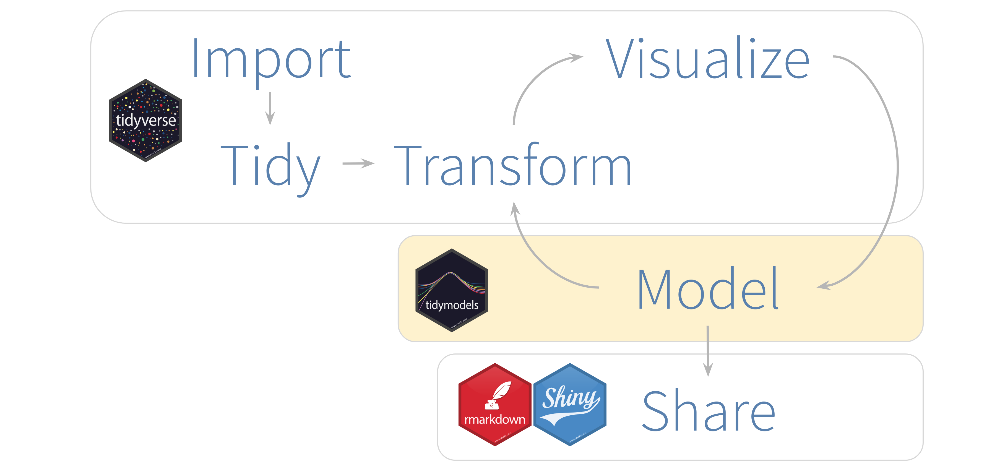
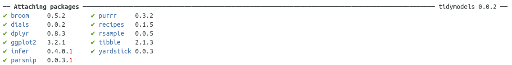

#https://rviews.rstudio.com/2019/06/19/a-gentle-intro-to-tidymodels/





- `rsample` - Different types of re-samples
- `recipes` - Transformations for model data pre-processing
- `parnip` - A common interface for model creation
- `yardstick` - Measure model performance


```{r echo=TRUE, message=FALSE, warning=FALSE}
library(tidymodels)
```



## Pre-Process

### Data Sampling
```{r}
iris_split <- initial_split(iris, prop = 0.6)
iris_split
```


```{r}
iris_split %>%
  training() %>%
  glimpse()
```

### armar la receta

```{r}
iris_recipe <- training(iris_split) %>%
  recipe(Species ~.) %>%
  step_corr(all_predictors()) %>%
  step_center(all_predictors(), -all_outcomes()) %>%
  step_scale(all_predictors(), -all_outcomes()) %>%
  prep()

iris_recipe
```


### Cocinar la receta

```{r}
iris_testing <- iris_recipe %>%
  bake(testing(iris_split)) 

glimpse(iris_testing)
```

```{r}
iris_training <- juice(iris_recipe)

glimpse(iris_training)
```


## Model Training

In R, there are multiple packages that fit the same type of model. It is common for each package to provide a unique interface. In other words, things such as an argument for the same model attribute is defined differently for each package. For example, the ranger and randomForest packages fit Random Forest models. In the ranger() function, to define the number of trees we use num.trees. In randomForest, that argument is named ntree. It is not easy to switch between packages to run the same model.

Instead of replacing the modeling package, tidymodels replaces the interface. Better said, tidymodels provides a single set of functions and arguments to define a model. It then fits the model against the requested modeling package.

In the example below, the rand_forest() function is used to initialize a Random Forest model. To define the number of trees, the trees argument is used. To use the ranger version of Random Forest, the set_engine() function is used. Finally, to execute the model, the fit() function is used. The expected arguments are the formula and data. Notice that the model runs on top of the juiced trained data.


```{r}
iris_ranger <- rand_forest(trees = 100, mode = "classification") %>%
  set_engine("ranger") %>%
  fit(Species ~ ., data = iris_training)
```


```{r}


iris_rf <-  rand_forest(trees = 100, mode = "classification") %>%
  set_engine("randomForest") %>%
  fit(Species ~ ., data = iris_training)
```


```{r}
iris_noengine <- rand_forest(trees = 100, mode = "classification") %>%
  fit(Species ~ ., data = iris_training)
```


## Predictions

```{r}
predict(iris_ranger, iris_testing)
```

```{r}
iris_ranger %>%
  predict(iris_testing) %>%
  bind_cols(iris_testing) %>%
  glimpse()
```


## Model Validation

```{r}
iris_ranger %>%
  predict(iris_testing) %>%
  bind_cols(iris_testing) %>%
  metrics(truth = Species, estimate = .pred_class)
```

```{r}
iris_rf %>%
  predict(iris_testing) %>%
  bind_cols(iris_testing) %>%
  metrics(truth = Species, estimate = .pred_class)
```

```{r}
iris_ranger %>%
  predict(iris_testing, type = "prob") %>%
  glimpse()
```


```{r}
iris_probs <- iris_ranger %>%
  predict(iris_testing, type = "prob") %>%
  bind_cols(iris_testing)

glimpse(iris_probs)
```


```{r}
iris_probs%>%
  gain_curve(Species, .pred_setosa:.pred_virginica) %>%
  glimpse()
```


```{r}
iris_probs%>%
  roc_curve(Species, .pred_setosa:.pred_virginica) %>%
  autoplot()
```


```{r}
predict(iris_ranger, iris_testing, type = "prob") %>%
  bind_cols(predict(iris_ranger, iris_testing)) %>%
  bind_cols(select(iris_testing, Species)) %>%
  glimpse()
```


```{r}
predict(iris_ranger, iris_testing, type = "prob") %>%
  bind_cols(predict(iris_ranger, iris_testing)) %>%
  bind_cols(select(iris_testing, Species)) %>%
  metrics(Species, .pred_setosa:.pred_virginica, estimate = .pred_class)
```


