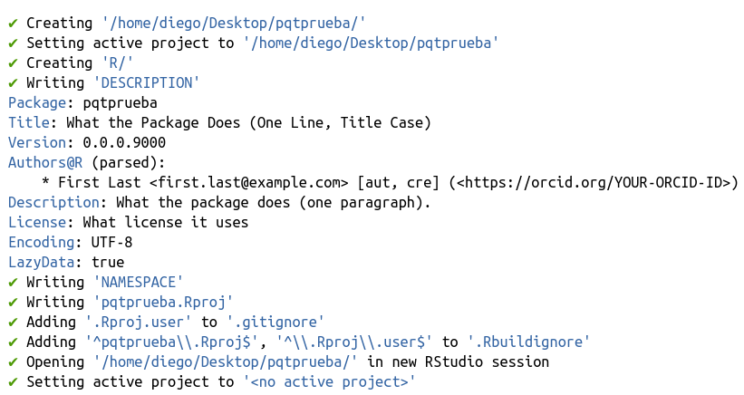
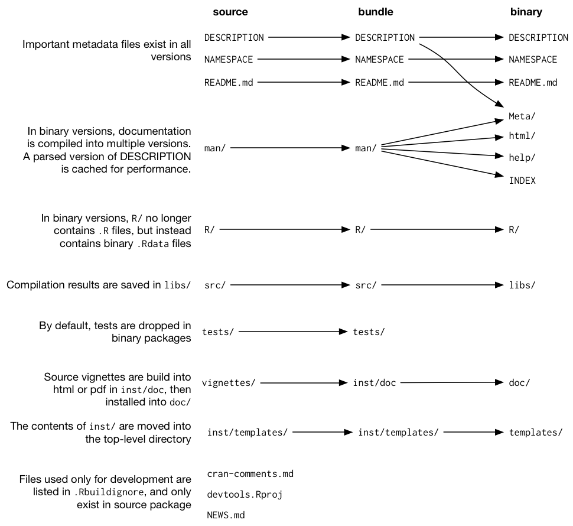
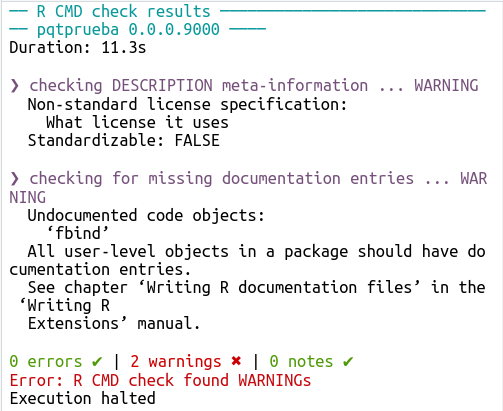
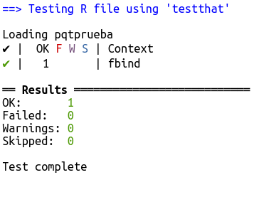
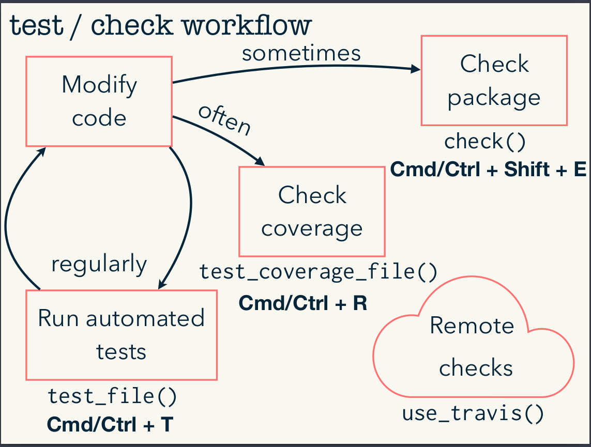
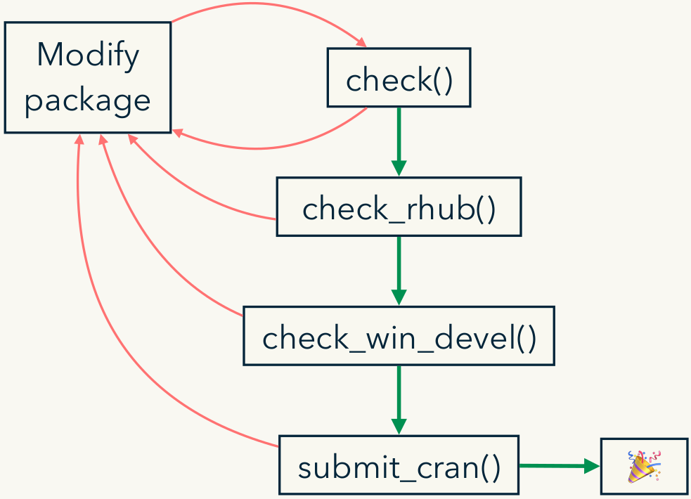

El objetivo de este workshop es introducir el uso de herramientas que simplifican la creación de paquetes en R. Es una interpretación libre y resumida del curso elaborado por:

  * Jenny Bryan [jennybryan.org](https://jennybryan.org) \| GitHub [jennybc](https://github.com/jennybc) \| Twitter [jennybryan](https://twitter.com/jennybryan)
  * Jim Hester [jimhester.com](https://www.jimhester.com) \| GitHub [jimhester](https://github.com/jimhester) \| Twitter [jimhester_](https://twitter.com/jimhester_)
  * Hadley Wickham [hadley.nz](http://hadley.nz) \| GitHub [hadley](https://github.com/hadley) \| Twitter [hadleywickham](https://twitter.com/hadleywickahm)


> Los materiales originales se encuentran en [https://github.com/hadley/pkg-dev](https://github.com/hadley/pkg-dev)

Vamos a realizar un paquete de juguete, siguiente [este capítulo](https://r-pkgs.org/whole-game.html)

## Setup

> Todo el código de estas notas de clase no debe ser corrido en el .rmd sino en el entorno del paquete

```r
install.packages(c(
  "devtools", "roxygen2",
  "testthat", "covr", "pkgdown"
))
usethis::use_course("http://bit.ly/30kL8QD")
```

# Workflow básico

## usethis

La herramienta principal para crear un paquete en R es `usethis`, un paquete que contiene un conjunto de funciones que simplifican el trabajo


### Creamos el paquete con `create_package()`

Esto crea el directorio con la estructura base del paquete

```r
usethis::create_package('~/Desktop/pqtprueba')
```




### Creamos nuestra función

Ejemplo. Queremos una función que concatene factores con propiedades más copadas que el default

```{r}
a <- factor(c("character", "in", "the", "streets"))
b <- factor(c("integer", "in", "the", "sheets"))

c(a,b)
factor(c(as.character(a), as.character(b)))
```


Cremos la función  `fbind`

```{r}
fbind <- function(a, b) {
factor(c(as.character(a), as.character(b)))
}
```


Para incorporarla al paquete utilizamos `usethis::use_r("file-name")`

```r
usethis::use_r("fbind")
```

- Escribimos nuestra función en R/fbind.R

- Con `devtools::load_all()` (o ctrl+shift+L) podemos cargar las funciones del paquete para ir probandolas en la consola. 

> Tenemos nuestra función que hace lo que queremos. Cómo sigue la cosa?

## Chequeamos el paquete


`Check` analiza el paquete para encontrar posibles `errors`, `warnings` o `notes`. Estos son tres niveles de gravedad de los problemas que presenta el paquete.

- Para que un paquete sea aceptada en CRAN no debe tener ni errores ni warnings, y los notes son inspeccionados por los evaluadores (en general existe un note para los paquetes que se suben por primera vez, y no debería haber otros más que este).

- Es importante correr muchos check a lo largo del desarrollo del paquete y manterlo limpio. Es mejor solucionar los problemas apenas aparecen.

```r
devtools::check()
```

También podemos correrlo desde Build --> Check.

Qué nos devuelve?




Nos esta indicando que:
 
 - No especificamos la licencia del paquete
 - No creamos la documentación para la función `fbind`
 
Para crear la licencia usamos el comando `usethis::use_mit_license()`

 
### Documentación

Para crear la documentación usamos el comando `devtools::document()` o ctrl+shift+D y el paquete [roxygen2](https://cran.r-project.org/web/packages/roxygen2/vignettes/roxygen2.html)
 

> Nos paramos sobre la función --> Code --> Insert roxygen skeleton

## Install.

Una vez que el paquete funciona, podemos usar `devtools::install()` para instalarla y utilizarla

# Testing


Es importante incorporar tests automáticos en nuestro paquete, de forma tal que cada vez que realizamos una modificación, automáticamente los test corroboren que no se rompió otra parte del paquete.

Para eso, utilizamos la función `use_test` que crea un nuevo script en la carpeta tests/testthat donde podemos escribir nuestros tests

```r
usethis::use_test('fbind')
```

Por ejemplo, para `fbind` podríamos armar el siguiente test

```r
test_that("fbind works", {

  factor1 <- factor(c('ola','k','ase'))
  factor2 <- factor(c('atr', 'perro', 'cumbia', 'cajeteala', 'piola', 'gato''))
  expect_equal(fbind(factor1,factor2),
               factor(c('ola','k','ase','atr','perro','cumbia','cajeteala','piola','gato')))
})

```

Aquí utilizamos la función `test_that` para construir el test, y dentro de ella `expect_equal` para indicar que el resultado del fbind debería ser dicho factor. 

En el script de test tenemos el boton _run tests_ arriba a la derecha y podemos ejecutarlos. El resultado es:



Lo cual indica que el test funciona correctamente.

> Ahora cada vez que hagamos un check, también ejecutará todos los tests. 

## Workflow:




En esta clase omitimos el tema del Check coverage y los checks remotos vía travis (ver notas originales).


# Compartir el paquete

Tener un paquete de funciones propio puede servirnos para evitar copiar las funciones en cada script o hacer source. Pero probablemente si el paquete es útil para nosotros, también sea útil para otras personas y querramos compartirlo.

Para eso, vamos a ver tres formas de compartir nuestro trabajo

1. Proyecto en github
2. Vignettes
3. pkgdown
4. submit a CRAN


## Paquete en Github


Hay muchas maneras de crear un repositorio en Github.

- La opción más simple es crear un repo vacío desde la página, clonarlo y luego pegar lo que ya tengamos en esa carpeta.
-  También podemos usar las funciones del paquete `usethis` `use_git()` y `use_github()`. 


```r
usethis::use_git()

usethis::use_github()
```
y desde la terminal

```terminal
git push --set-upstream origin master
```

La primera función define nuestra carpeta como un repo de git. La segunda crea un repositorio en github. Finalmente la tercera define el upstream de nuestro repo y pushea el contenido que tiene.

Para que esto funcione tenemos que tener previamente sincronizada nuestra computadora con una sesión en github.

Por ejemplo, para mí, estos comandos crearon el siguiente repo: [https://github.com/DiegoKoz/pqtprueba](https://github.com/DiegoKoz/pqtprueba)

### Flujo de trabajo en github

Una vez que nuestro paquete esta en github, deberíamos subir las actualizaciónes de las funciones con:

1. Add
2. Commit
3. Push

- Esto es sólo el flujo básico de github y hay muchas más cosas que se pueden hacer. Pero para esta clase lo restringimos a este mínimo. Esto lo podemos hacer desde la terminal o desde el IDE de Rstudio. 

- Un buen lugar para leer más sobre Git y Github con R es [https://happygitwithr.com/](https://happygitwithr.com/)

Para que la librería tenga una buena presentación, deberíamos agregar un README.

```r
usethis::use_readme_rmd()
```

Luego de modificar el readme, tenemos que subirlo a github nuevamente!


## Vignette

Si queremos que la gente utilice nuestro paquete, lo mejor es que la documentación haga sencillo entender qué hace y para qué sirve. 

Para crear una vignette podemos usar el comando

```r
usethis::use_vignette(name = 'prueba_vignette',title = 'Ejemplo de Vignette')
```

- No se olviden de commitearlo!!


## pkgdown


Ahora lo que queremos es que nuestra librería tenga su propia página web

Para ello, usamos la librería [pkgdown](https://pkgdown.r-lib.org/)

```r
pkgdown::build_site()
```

hace todo por nosotros!! 

{width=500}

Esto crea una carpeta docs/ en el repo, con todos los materiales de la página.  Lo que nos falta ahora es publicar la página desde github. Para eso, vamos a

1. Settings
2. GitHub Pages
3. Source --> master branch /docs folder

Para mi, esto genera la página [https://diegokoz.github.io/pqtprueba/](https://diegokoz.github.io/pqtprueba/)


## Submit a CRAN

{width=500}

Cuando un paquete se encuentra en CRAN es porque fue debidamente revisado y se pude confiar en su performance. Eso implica que para que podamos subir nuestro repositorio a CRAN debemos cumplir varios requisitos.

- El archivo description debe estar debidamente completado con:
  - Título, 
  - Número de versión actualizado (para eso podemos usar ` usethis::use_version()`)
  - Autores
  - Descripción
  - Dependencias (Imports: y los paquetes que usa el nuestro)
  - BugReports
  - Si la documentación esta en español debemos aclarar con `Language: es`
  
   
- La librería no debe tener ningún error, warning o note cuando la chequeamos.
- Además, podemos hacer chequeos externos con

```r
devtools::check_rhub()
devtools::check_win_devel()
```


- Si todas las formas de chequeo funcionan bien, podemos pensar en subirlo a CRAN.

- Para eso, primero usamos `usethis::use_cran_comments()` para crear el archivo con comentarios para el revisor de CRAN. 

- Si es rechazado, incorporamos los comentarios del revisor y en el archivo cran-comments.md agregamos arriba

```
This is a resubmission. Compared to the last submission, I
have:
* First change.
* Second change.
* Third change

---
```


