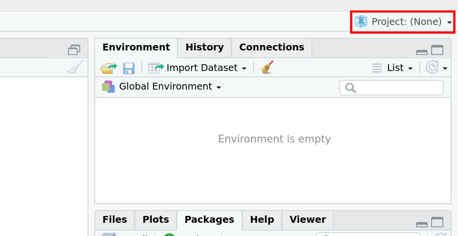
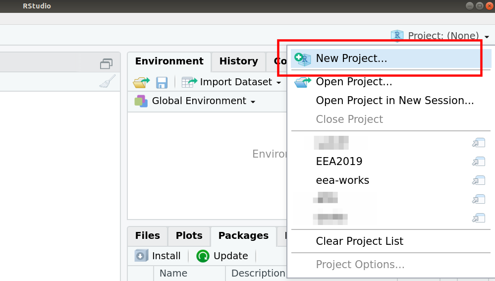
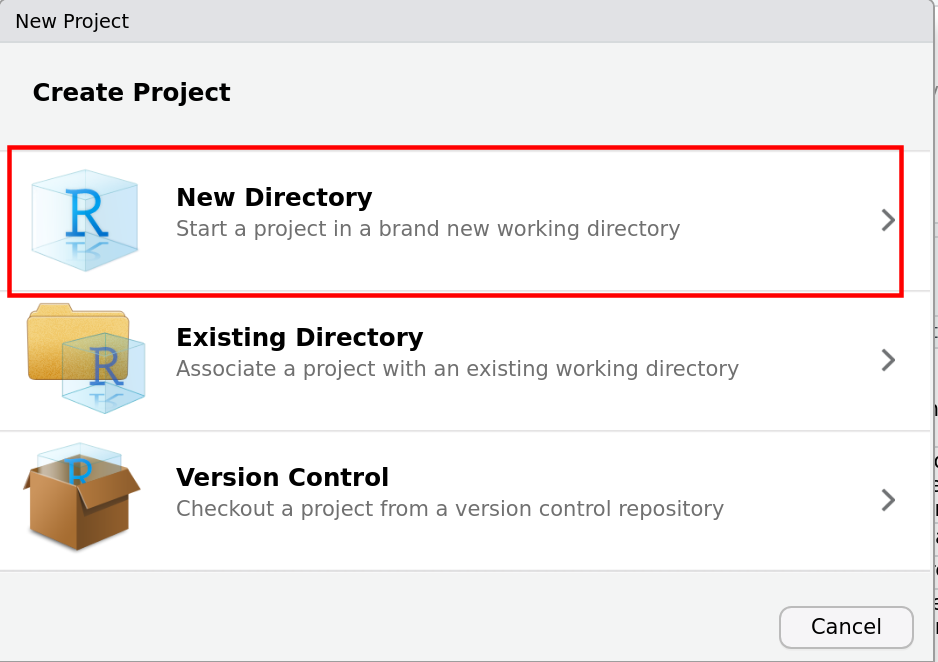
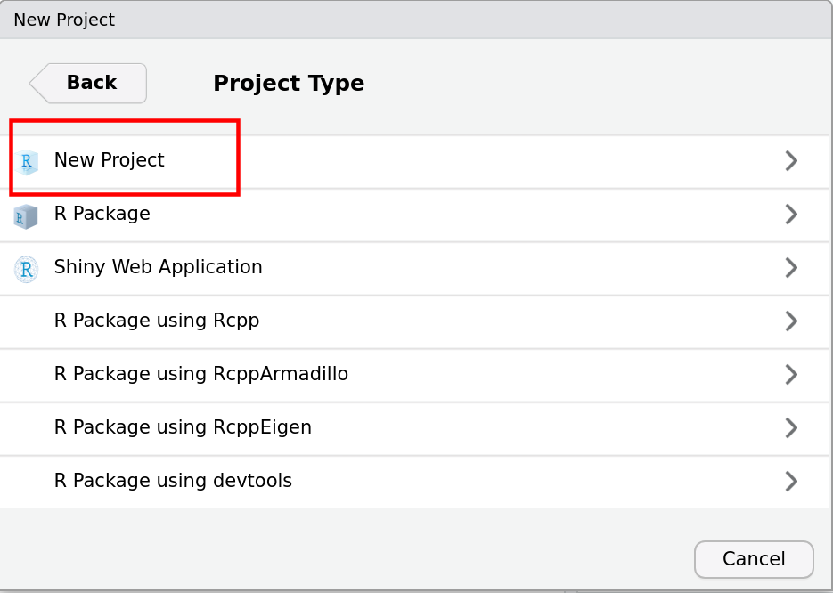
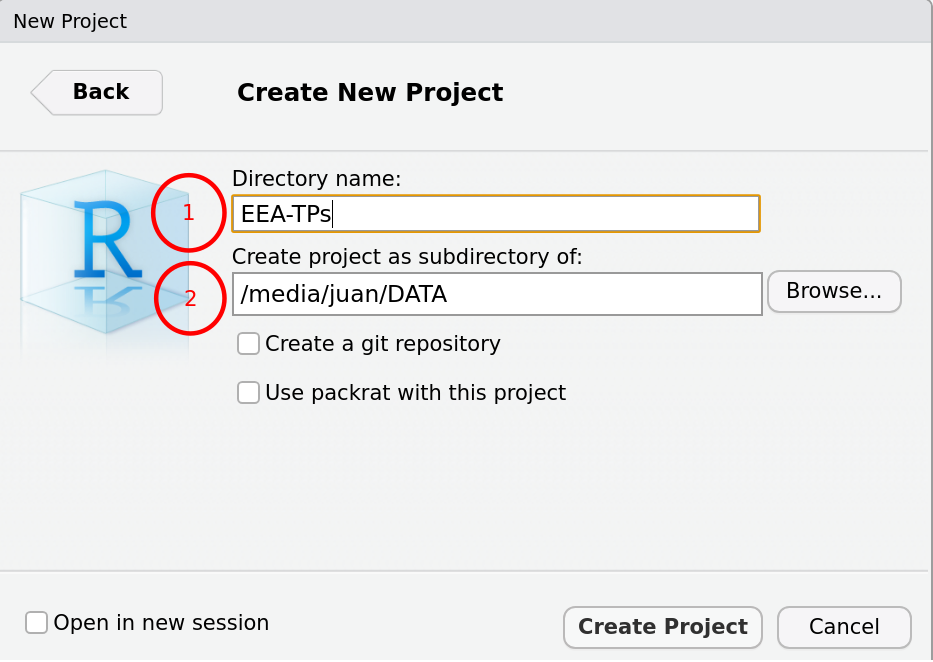
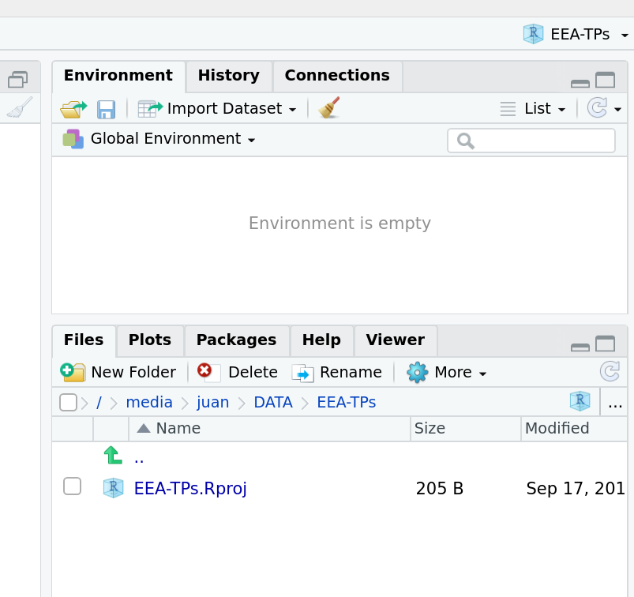

Esta es una pequeña guía de como proceder con la realización de los trabajos prácticos

## 1. Crear un R Project

Los proyectos de R permiten trabajar manera ordenada ya que funcionan como carpetas o directorios. En ellos se guardan los scripts, notebooks, bases de datos, imagenes, etc y ademas se pueden vincular a herramientas de control de cambios (GIT).

Para crear un R Project

1. Seleccionar el menu de proyectos en la esquina superior derecha de R Studio

{ width=75% }

2. Seleccionar **New Project...**

{ width=75% }

3. Seleccionar **New Directory**. Las otras versiones permiten crear proyectos a partir de carpetas existentes o a partir de un repositorio de Git.

{ height=75%, width=75%}

4. Seleccionar **New Project**

{ height=75%, width=75%}

5. Escribir el nombre del directorio/proyecto en (1). Recomendamos que usen EEA-TPs como nombre. Seleccionar donde van a crear el proyecto en (2)

{ height=75%, width=75%}

6. Esperar a que se cree el proyecto. Luego de creado deberían llegar a esta misma imagen: en la esquina superior derecha figura el nombre del proyecto y debajo en **Files** contar con el archivo *EEA-TPs.Rproj*

{ height=66%, width=75%}

Ahora ya pueden comenzar a trabajar dentro del proyecto.

### Recomendaciones:

* Mantener un proyecto ordenado: organizar los scripts y notebooks en carpetas. Por ejemplo: crear una carpeta para cada trabajo práctico.

* No guardar el entorno de trabajo, es decir, no guardar el workspace al cerrar el proyecto.